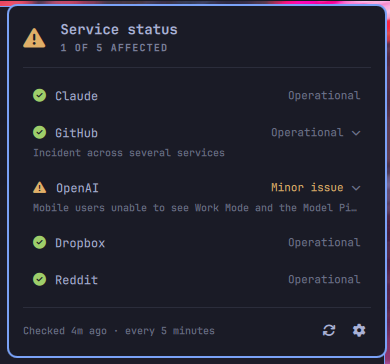

# MIB Status Check



Why bother getting notifs about services going down? How often does something
like GitHub actually go down? More often than you'd think, and usually right
when a push hangs or Claude stops answering and you're left wondering whether
it's you or them. This answers that in a glance.

An [Omarchy](https://omarchy.org/) bar widget that watches the status pages of
the services you depend on (GitHub, Claude, Cloudflare and many more). The bar
shows the worst status across all of them, you get one quiet notification per
change, and a click opens a popup that shows what is broken.

## What it does

- Watches up to **10 status pages** on one timer, in one batched request.
- The bar icon shows the **worst** status across everything you watch: a check
  when all is well, a warning glyph when it isn't.
- Sends one desktop notification **per service** whenever its status changes:
  a new incident, an update, a component degrading or recovering, or a return
  to normal.
- The popup has **one compact line per service**. Click a line to unfold its
  ongoing incident.
- A built-in **settings view** (the gear) manages the service list and the
  check interval. Nothing to hand-edit.
- Colors come from your current Omarchy theme and follow theme switches live.

## What can be watched

Any service with an [Atlassian
Statuspage](https://www.atlassian.com/software/statuspage)-compatible feed, meaning its
page serves `/api/v2/summary.json`. That covers a great many services,
including every page hosted on incident.io (Linear, for example). Pick one
from the presets or paste any other status page URL. A pasted URL is checked
before it is added, so an incompatible page is rejected with an explanation.

Presets:

| | | | |
|---|---|---|---|
| 1Password | DigitalOcean | MongoDB | Squarespace |
| Airtable | Discord | Netlify | Stripe |
| Atlassian | Docker | npm | Supabase |
| Bitbucket | Dropbox | OpenAI | Tailscale |
| CircleCI | Elastic | Plaid | Twilio |
| Claude | Epic Games | Proton | Vercel |
| Cloudflare | Figma | Reddit | Wikipedia |
| Cloudinary | GitHub | Sentry | Zapier |
| Coinbase | HashiCorp | Shopify | Zoom |
| Datadog | Jira | Snowflake |  |

**Not watchable:** Google (including YouTube and Gmail), X/Twitter, Slack, AWS,
Azure and Heroku. Each runs its own status format. Support for some of these is
on the [roadmap](ROADMAP.md).

## Requirements

- Omarchy, with its shell
- `curl` and `jq`, both installed with Omarchy

## Install

```bash
omarchy plugin add https://github.com/mindows/mib-statuscheck.git --enable
```

You'll be asked which bar section to put it in (the default is right). It
starts out watching nothing. Click the icon, then the gear, to choose your
services.

## Usage

| Input | Effect |
|---|---|
| left click the icon | toggle the popup |
| right click the icon | check now |
| middle click the icon | open settings |
| click a row | unfold / fold its incident detail |
| middle click a row | open that service's status page |
| `j` / `k`, arrows | move the row cursor |
| `Enter` / `Space` | unfold the row under the cursor |
| `o` | open the cursored service's status page |
| `r` | check now |
| `s` | toggle the settings view |
| `Esc` | leave settings, or close the popup |

Notifications expire on their own (15 s for an outage, 6 s for a recovery).
The bar icon stays lit until the service actually recovers. Click a toast to
dismiss it, or use Omarchy's `Super` + `,` (dismiss last) and `Super` +
`Shift` + `,` (dismiss all).

Adding a service that is *already* having problems doesn't send a
notification. Only later changes do.

## Settings

Managed in the popup's settings view and stored on the widget's entry in
`~/.config/omarchy/shell.json`:

```json
{
  "id": "mib-statuscheck",
  "refreshIntervalSec": 300,
  "notify": true,
  "hideWhenOperational": false,
  "services": [
    { "name": "Claude", "url": "https://status.claude.com" },
    { "name": "GitHub", "url": "https://www.githubstatus.com" }
  ]
}
```

| Key | Default | Meaning |
|---|---|---|
| `services` | none | Pages to watch, up to 10. |
| `refreshIntervalSec` | `300` | Seconds between checks. The settings view offers 5m / 15m / 30m / 1h / 3h; a hand-edited value is clamped to 60–21600. |
| `notify` | `true` | Send a notification when a service's status changes. |
| `hideWhenOperational` | `false` | Keep the icon off the bar unless something is wrong. |

Hand-editing is safe. The list is re-validated on load: bad URLs are
dropped, duplicates are merged, and the list is capped at 10. A service's
`name` is only a label. Leave it out and the provider's own page name is used.

## Scripting

The widget registers an IPC target, so a dotfiles bootstrap can set it up
without editing `shell.json`:

```bash
omarchy-shell mib-statuscheck state            # one line per service
omarchy-shell mib-statuscheck presets          # every preset name
omarchy-shell mib-statuscheck addPreset GitHub # add by preset name
omarchy-shell mib-statuscheck add status.figma.com  # add by URL (verified first)
omarchy-shell mib-statuscheck remove GitHub    # by name or URL fragment
omarchy-shell mib-statuscheck interval 900     # seconds
omarchy-shell mib-statuscheck refresh          # check now
omarchy-shell mib-statuscheck toggle           # open/close the popup
omarchy-shell mib-statuscheck openSettings     # open on the settings view
omarchy-shell mib-statuscheck expand Cloudflare # open with one detail unfolded
```

`expand` is handy for a keybinding that shows what's wrong with one service.
`remove` only acts on a single match. If a fragment matches several services,
it lists them and removes nothing.

## Network and privacy

- **Hosts contacted:** only the status pages you add. On each check (every 5
  minutes by default), the widget sends one `GET` to each page's
  `/api/v2/summary.json`. It also makes one request when you add a URL, to
  verify it. The requests carry no identifiers or cookies, but, like any web
  request, they show your IP address to each status page's host.
- **Stored locally:** your settings, in the widget's entry in
  `~/.config/omarchy/shell.json`. Nothing else is written to disk.
- **Never:** no telemetry, no analytics, no accounts, and nothing is sent to
  the author.
- **System access:** desktop notifications (which you can turn off in
  settings), and opening status pages in your browser when you ask.

## Update

```bash
omarchy plugin update mib-statuscheck
```

## Remove

```bash
omarchy plugin remove mib-statuscheck
```

This removes the widget from the bar and deletes the plugin folder. Its
settings, including your service list, are stored on the bar entry, so they
are removed with it and nothing is left behind. Disabling the plugin
(`omarchy plugin disable`) also drops the bar entry. To keep your list, save
the output of `omarchy-shell mib-statuscheck state` first.

## Troubleshooting

- **The icon doesn't appear:** run `omarchy plugin list` to check it's
  enabled, then `omarchy restart shell`. If `hideWhenOperational` is on, the
  icon only shows when something is wrong.
- **A row says "Unreachable":** the page didn't answer this check. The last
  good reading is kept, and an unreachable page is never counted as down.
- **A URL won't add:** the page doesn't serve a Statuspage-compatible feed
  (see [What can be watched](#what-can-be-watched)), or its address includes
  a port, which isn't supported.

## Contributing

Bug reports, preset requests and pull requests are welcome. See
[CONTRIBUTING.md](CONTRIBUTING.md) for the development setup, and
[docs/design.md](docs/design.md) for why the widget behaves the way it does.

## License

[MIT](LICENSE)
